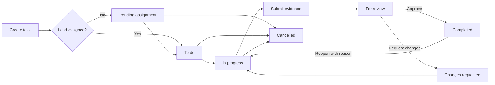

# Task management flow

## Roles and visibility

- Department heads create and plan work, choose the task team and lead, choose primary and backup reviewers, supervise workload, and review submissions routed to them.
- Employees see assigned and delegated work, start eligible tasks, complete their own subtasks, discuss work, attach evidence, and submit for review.
- Team leaders use the employee workflow plus leading-work and leader-review destinations when they are actually leading a task.
- Super administrators retain organization-wide visibility and administrative override capabilities. Review override never permits approving the administrator's own submission.

## Lifecycle

## Planning and assignment

1. Creation records the title, description, priority, schedule, hierarchy, acceptance criteria, definition of done, dependencies, and organization scope.
2. Unassigned work starts as `pending_assignment`; assigned work starts as `todo`.
3. `assign_task_with_details` changes the lead, team membership, and reviewer routing in one transaction. Active-profile and task-management checks run on the server.
4. Dependencies must be completed before submission. Team members can be delegated subtasks, but task-level assignment remains controlled by the task manager.

## Execution and subtasks

- A task participant moves eligible `todo` or `changes_requested` work to `in_progress`.
- The task manager can create, reassign, and delete subtasks. A delegated member can only check or uncheck their own subtask; database triggers reject attempts to edit protected fields.
- Subtask totals are rolled up by database triggers, avoiding conflicting client-side counters.
- Discussion and task chat remain attached to the task throughout its lifecycle.

## Submission and review

1. Files are uploaded to the task attachment bucket under a unique submission path.
2. `submit_task_for_review` validates the submitter and dependencies, creates a versioned immutable `task_submissions` row, links attachment records to that version, changes the task to `for_review`, and notifies the resolved reviewer atomically.
3. Review eligibility is the primary reviewer, backup reviewer, or super administrator. The submitter cannot decide their own attempt.
4. `decide_task_review` records the decision, feedback, status history, notification, audit event, and server-generated SHA-256 audit hash in one transaction.
5. A requested change preserves the prior attempt and feedback. The next submission becomes a new version, so evidence from different attempts is never mixed.

## Completion, cancellation, and retention

- Approved work becomes `completed`. Reopening requires a reason and is recorded in history.
- Cancellation requires a reason and uses an audited server RPC; it is distinct from deletion.
- Archive/unarchive and soft delete use audited RPCs rather than direct client writes.
- Due-soon, overdue, escalation, and waiting-for-review reminders are deduplicated per task, recipient, kind, and day.
- Recurring templates materialize tasks idempotently and advance their next scheduled run even if a prior run already exists.

## Invariants

- Sidebar section IDs and page labels are navigation contracts.
- Lifecycle and permission checks are server-authoritative.
- Supabase schema changes are additive migrations; public service return types remain stable.
- Storage upload cleanup runs when the database submission transaction fails.
