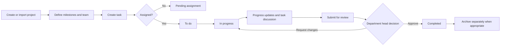

# Task Flow Stabilization and Dashboard Accuracy Plan

## Purpose

Stabilize the existing **web** task-management workflow so that tasks, projects, dashboards, reviews, reports, notifications, and activity history all represent the same truth. This is a corrective implementation plan, not a new feature roadmap.

**Out of scope:** Enhancements to the existing AI/LLM features, genetic-algorithm optimization, blockchain enhancements, process-mining capabilities, mobile/PWA delivery, and native mobile development.

## Assessment: is the flow good now?

The intended workflow is good and the repository now has most of the screens needed to support it. It has projects, milestones, assignments, employee updates, review, reports, announcements, task discussions, permissions, and audit views.

However, the **live operational flow is not reliable enough to call complete yet**. The largest problems are data integrity and inconsistent sources of truth, not a lack of another dashboard screen.

The current intended workflow should be:

Projects, task boards, employee workspaces, review queues, reports, notifications, and dashboards must all be derived from this same lifecycle.

## Evidence from the current database and application

The database was read on 15 July 2026. The findings below are concrete and should be treated as the first repair backlog:

| Finding | Current observation | Effect |
|---|---:|---|
| Tasks with an assignee but `pending_assignment` status | 8 of 8 | Admin and department dashboards classify assigned work as unassigned; employees do not get a trustworthy starting state. |
| Canonical task-to-project links | 0 of 8 | Department dashboard and Employee **My Projects** cannot calculate project health or show project work correctly. |
| Legacy-only task project references | 8 of 8 | The old `project_id` references do not match any current `projects.id`; this must be reconciled, not blindly copied. |
| Task milestones | 0 linked tasks | Milestone progress and deadline reporting have no task basis. |
| Progress updates, task comments, task activities | 0 rows | The newer collaboration flow has not yet been exercised with real workflow data. |
| Dashboard metric hook | Hard-codes project and task metrics to `0` | The Super Admin dashboard can show false zeroes even when data exists. |
| Discussion UI | Two task-chat systems exist | A discussion can disappear from the new task timeline because it is stored in the older chat system instead of `task_comments`. |

Additional code-level issues to correct:

- `ProjectsWorkspace` temporarily reads both `projectId` and `linkedProjectId`, while Department Head dashboard and Employee **My Projects** only read `linkedProjectId`. This creates different answers on different screens.
- The Admin **Unassigned** filter treats `pending_assignment` as unassigned even when `assigneeId` exists.
- Generic client-side status updates can bypass a defined lifecycle. Several task mutations do not consistently create history, activity, audit, and recipient notifications together.
- Some status-change/review/reopen notifications are addressed to the acting user rather than the affected employee.
- Current RLS policies allow every authenticated user to read all task progress updates, comments, and comment attachments. Task conversations must be limited to people allowed to view that task.
- Project creation currently performs related writes separately. A failed member or milestone write can leave a partial project.

## Guiding decisions

1. `tasks.linked_project_id` becomes the only canonical task-to-project relationship. `tasks.project_id` is legacy data and must be retired after reconciliation.
2. A task is **unassigned only when its assignee is null**. `pending_assignment` must never coexist with an assignee.
3. The backend, not a drag-and-drop UI, owns status-transition authorization and side effects.
4. A task has one auditable discussion stream: `task_comments`. The old task chat must not remain a parallel official record.
5. Dashboards and reports use shared metric selectors and the same task/project filters. A failed fetch must show an error state, never a convincing zero.
6. Archive is a separate lifecycle flag, not a task status.

---

## Phase 0 — Reconcile and protect existing data

**Goal:** Repair the current records safely before using them to judge dashboard accuracy.

### 0.1 Create a pre-repair backup and reconciliation report

- Export `projects`, `tasks`, `project_members`, `milestones`, `task_status_history`, `task_activities`, and `audit_events` to a timestamped restricted backup.
- Build an admin-only reconciliation report listing every task with:
  - task ID and title;
  - legacy `project_id` and canonical `linked_project_id`;
  - owning organization, creator, assignee, and status;
  - potential project matches by trusted import/source identifier, not title alone;
  - a recommended action: link, leave unlinked, normalize assignment state, or investigate.
- Record the migration batch and before/after values in `audit_events` using a `task.data_repaired` action. Do not create employee notifications for bulk historical repairs.

### 0.2 Resolve project links deliberately

- Do **not** automatically copy the present legacy `project_id` values: none of the eight currently match a live project ID.
- Prefer an immutable imported source key (proposal/import ID) to map a task to a project. Add one if import records do not yet have a durable key.
- Where a trustworthy mapping exists, populate `linked_project_id`.
- Where no trustworthy mapping exists, require an administrator or Department Head to select the project in the reconciliation screen. Leave the task visibly **Needs project link** until resolved; do not guess from a similar title.
- Associate a milestone only when it was explicitly supplied by the source or selected by an authorized manager. Unlinked milestones are better than invented reporting data.
- After all live records are reconciled, update task creation/import flows to write `linked_project_id` only. Remove the permanent dual-field fallback from `ProjectsWorkspace`.

### 0.3 Normalize assignment state

- For each task with an active valid assignee and `pending_assignment`, move it to `todo` after an authorized owner validates the import/assignment.
- For each task without a valid assignee, clear stale assignee metadata and retain `pending_assignment`.
- Write a `task_status_history` entry for every normalized state and one concise audit event per repair batch.
- Add database validation so a task cannot be saved as `pending_assignment` with an assignee, or as an active assigned status with no assignee.

### 0.4 Prevent repeat import damage

- Add an import batch/source identifier and a uniqueness strategy for imported projects and tasks.
- Make imports idempotent: re-running the same source updates the intended draft/import record or refuses with a clear conflict; it must not duplicate project-created audit events.
- Show import validation results before committing: invalid owner, absent department, missing project link, invalid deadline, duplicate source item, and unknown employee.

**Exit criteria:** every non-archived task has either a validated `linked_project_id` or a visible `Needs project link` exception; no task is both assigned and pending assignment; all repairs are auditable and reversible from the backup.

---

## Phase 1 — Establish one operational data and metric source

**Goal:** Make every dashboard and report calculate the same values from live scoped records.

### 1.1 Replace placeholder and duplicate hooks

- Replace the hard-coded zero values in `src/app/hooks/useSupabaseData.ts` `useDashboardMetrics` with live projects and tasks.
- Consolidate the overlapping `useSupabaseData` and misleadingly named `useFirebaseData` hooks into one operational-data layer. Rename the latter or remove it; it currently makes it easy for screens to receive empty project arrays.
- Create shared selectors/services for:
  - active projects;
  - active, archived, completed, overdue, unassigned, in-progress, and for-review tasks;
  - project completion and project health;
  - workload by active employee;
  - task completion rate;
  - upcoming deadlines.
- Make the selector inputs explicit: task list, project list, profile/organization scope, current date/time zone, and archival policy. Do not make each screen invent its own filters.

### 1.2 Correct metric definitions

| Metric | Canonical definition |
|---|---|
| Unassigned | `assignee_id IS NULL` and not archived/deleted. It is not inferred from an outdated status. |
| Active task | Not deleted, not archived, and not completed. |
| Overdue | Active task with a valid due date before the local operational date. Exclude completed/archived tasks. |
| Pending review | Status is `for_review`; show its designated reviewer and submission date. |
| Project health | Derived from canonically linked tasks, milestones, due dates, and overdue work. A project with no linked task must say **No task data**, not “healthy.” |
| Workload | The count (and optionally weighted effort) of active assigned tasks; use the same definition on Department Head and Admin screens. |

### 1.3 Repair dashboards and views

- **Super Admin dashboard:** show real system-wide project/task counts, pending reviews, active departments, overdue work, and a last-refresh/error state.
- **Department Head dashboard:** calculate health, workload, deadlines, completion, and review queue only from the department scope and canonical task links.
- **Employee My Projects:** derive membership from project membership plus canonically linked assigned tasks; show an honest empty state when no project is linked.
- **Admin Tasks and Reports:** correct the Unassigned filter, use the shared selectors, and show applied filter totals.
- Standardize archive/deleted filters at the query/service level so screens do not individually remember to remove archived tasks.
- If a required table/migration is unavailable, display a configuration error with retry guidance rather than silently returning an empty dashboard.

**Exit criteria:** totals in all three dashboards match the same filtered database query; fixing or archiving one task changes every relevant card, board, report, and workload count consistently.

---

## Phase 2 — Make the task lifecycle authoritative and atomic

**Goal:** Enforce a predictable workflow, regardless of which screen performs the action.

### 2.1 Adopt a clear status model

Add the explicit `changes_requested` state. The present approach—an `in_progress` task with a rejection note—makes task history and reports unable to distinguish ordinary work from rejected work.

| From | To | Allowed actor | Required evidence |
|---|---|---|---|
| `pending_assignment` | `todo` | Department Head/Admin | Valid assignee |
| `todo` | `in_progress` | Assigned employee | Start action |
| `in_progress` | `for_review` | Assigned employee | Submission note; attachments optional unless the task requires one |
| `for_review` | `completed` | Designated reviewer/Department Head | Approval decision; optional feedback |
| `for_review` | `changes_requested` | Designated reviewer/Department Head | Non-empty feedback |
| `changes_requested` | `in_progress` | Assigned employee | Resubmission work begins |
| `completed` | `in_progress` | Department Head/Admin | Mandatory reopen reason |

- Keep `archived_at` separate from the state machine.
- Migrate older rejected/rework tasks using their rejection metadata into `changes_requested` where that interpretation is safe; preserve history instead of deleting it.

### 2.2 Move status mutations to one protected backend operation

- Implement a Supabase RPC/database function or secured server endpoint such as `transition_task_status`.
- It must derive the actor from the authenticated identity, validate organization and permission scope, check the transition table, and complete all side effects in one transaction:
  1. update task state and `last_activity_at`;
  2. insert `task_status_history`;
  3. insert a task activity/timeline item;
  4. create the audit event;
  5. create notifications for the correct recipients.
- Remove generic direct status changes from `updateTask`, drag-and-drop actions, and any alternate board path. The UI should request a transition, not write a state value.
- Make assignment/reassignment use the same command pattern: validate assignee organization and active status, set `todo` when appropriate, record history/activity/audit, and notify the new assignee.
- Check and surface every Supabase write error. A UI must never show success after a failed history, upload, or status write.

### 2.3 Correct notification recipients and review ownership

- Store or resolve a designated reviewer rather than relying only on `created_by` when that is not the actual supervisor.
- Assignment and reassignment notify the employee; submission notifies the reviewer; approval, change request, and reopen notify the assignee; comments notify relevant task participants except the author.
- Prevent duplicate self-notifications and use idempotency keys where a retried operation could resend the same notice.

**Exit criteria:** an unauthorized direct status update fails; every allowed transition yields exactly one status-history item, one activity item, one audit item, and appropriate recipient notifications.

---

## Phase 3 — Unify the role workflows and collaboration record

**Goal:** Every role completes the same task lifecycle without hidden alternate paths.

### 3.1 Department Head

- Make the **For Review** queue the authoritative review surface. It must show project, milestone, employee, submission note, attachments, latest progress update, prior feedback, discussion, and activity timeline.
- Require feedback when requesting changes, and return the employee directly to the task workspace with a clear `changes_requested` badge.
- In the Department dashboard, link every metric card to the correctly scoped filtered list so the displayed number is explainable.
- Keep project creation, members, milestones, archive, and task mapping in the Projects workspace; prevent incomplete project creation through atomic backend writes or visible recovery of partial drafts.

### 3.2 Employee

- Make **My Tasks** the operational entry point: start work, submit a structured update, comment, attach evidence, and submit for review.
- Make **My Projects** depend on canonical project links and project membership. Show milestone, team, documents, related tasks, and project health only when data is present.
- Keep **Task History** as a status/audit view for completed, changes requested, reopened, and archived work; include the reason and reviewer feedback.
- Ensure the deadline/reminder view uses the same due-date logic as the dashboard and does not list completed/archived work as active.

### 3.3 Use one task discussion and timeline

- Make `task_comments` plus `task_progress_updates` the official task collaboration record shown in `TaskDiscussion` and `TaskActivityTimeline`.
- Retire the older `MondayBoard` task-chat panel as an official task discussion source. If historic chat messages must be kept, show them read-only as **Legacy messages** or migrate them with provenance; do not silently delete them.
- Every task detail surface should open the same canonical detail drawer/modal and timeline. Avoid a separate legacy task editor with different status rules.

**Exit criteria:** a Department Head can trace one task from assignment through updates, comments, submission, decision, and history from a single task detail view; the employee sees the same record within their scope.

---

## Phase 4 — Close authorization, privacy, and integrity gaps

**Goal:** Enforce the role model in the database, not only in the sidebar.

- Replace `using (true)` read policies on `task_progress_updates`, `task_comments`, and `task_comment_attachments` with task-scope policies. Access should be limited to the assigned employee, task creator/reviewer, permitted Department Head, project member where intended, and authorized system administrators.
- Scope storage upload/download policies for task attachments to the same task permissions. Signed URLs must be generated only after the requester is authorized.
- Deny direct task status writes through ordinary table permissions; allow the authoritative transition function only.
- Verify all role permissions are enforced by both frontend route guards and RLS/RPC checks. Frontend hiding is usability, not security.
- Add database constraints and tests for valid assignee/profile, organization alignment, valid project/milestone relation, state/assignee consistency, and non-null review feedback for changes requested.
- Make audit events append-only for normal users and capture actor, timestamp, organization, action, entity, before/after summary, and reason without storing unnecessary sensitive attachment content.

**Exit criteria:** direct REST attempts from an employee account cannot read another department's task discussion or change task state outside the permitted lifecycle.

---

## Phase 5 — Verification, observability, and polish

**Goal:** Prove the correction with realistic role-based scenarios before calling the system polished.

### Required automated checks

- Unit tests for every shared dashboard selector and date/overdue edge case.
- Unit tests for the complete transition matrix, rejected/reopened mappings, and notification recipient resolution.
- Integration tests for the protected transition operation, audit/history/activity transaction, RLS task discussion scope, and import idempotency.
- Browser/E2E tests using an Admin, Department Head, and Employee account for:
  1. project → milestone → task → assignment;
  2. employee start → update → comment → submit;
  3. Department Head approve and request-changes paths;
  4. dashboards/reports after each transition;
  5. archive/reopen and employee Task History;
  6. unauthorized direct URL/API access.

### Operational checks

- Add a restricted Admin data-health panel showing: pending tasks with assignees, tasks missing a canonical project, invalid milestone links, overdue tasks without due dates, and failed import batches.
- Add explicit loading, empty, stale, and error states to all metric cards.
- Log and alert on failed project/task mutation chains; do not mask a missing table or RLS failure as empty operational data.
- Reconcile a sample report/export against the same dashboard filters before release.

---

## Recommended delivery order

1. **Data backup, reconciliation report, project-link repair, and status normalization.**
2. **Canonical operational data layer and dashboard/report metric correction.**
3. **Protected task transition command, notification fixes, and complete state history.**
4. **Single task-detail/discussion experience and role-flow cleanup.**
5. **RLS/storage hardening, import idempotency, tests, and data-health monitoring.**

Do not start new AI, GA, process-mining, or visual-dashboard expansion work until items 1–3 are verified. Otherwise those features will produce polished-looking but incorrect conclusions from inconsistent task data.

## Completion checklist

- [ ] No active task is assigned while in `pending_assignment`.
- [ ] Every active task is canonically linked to the correct project or is explicitly flagged for authorized resolution.
- [ ] Department Head, Admin, and Employee dashboards agree with the same filtered data query.
- [ ] Project, milestone, task, and report numbers update consistently after one workflow action.
- [ ] Status transitions, review feedback, history, activity, audit, and notifications are created atomically.
- [ ] There is one official, permission-scoped task conversation and timeline.
- [ ] Employees cannot access another department's progress updates, comments, or attachments.
- [ ] All role-based end-to-end scenarios pass against a non-demo dataset.
